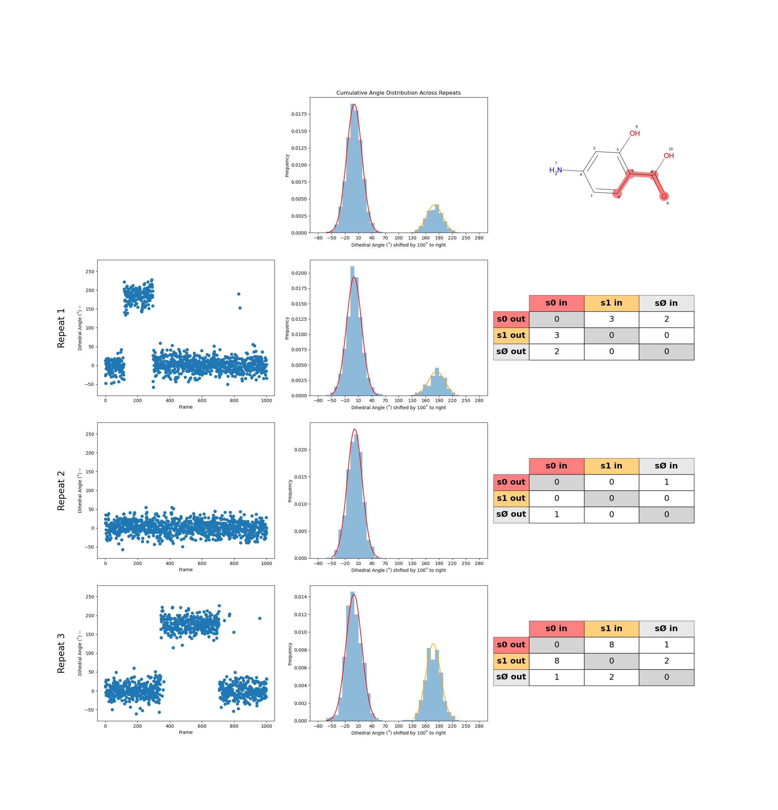
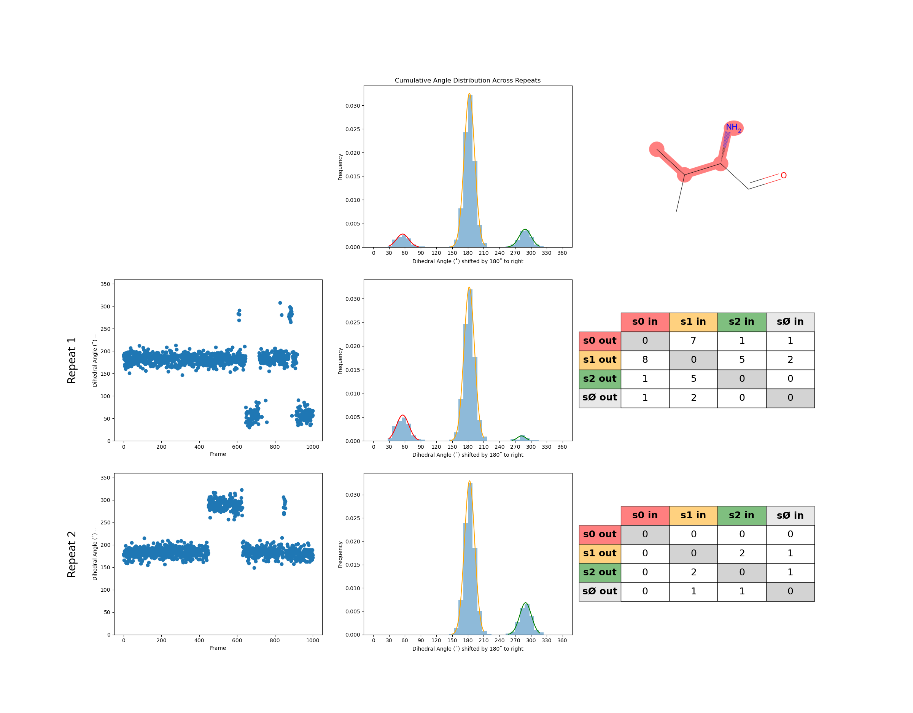

# Getting Started

This guide will help you quickly install `slow-rotations`. A molecular dynamics simulation analysis package to flag slow torsional motions that may indicate sampling issues. 

## Installation

1. Clone the [github repository](https://github.com/MobleyLab/slow-rotations/tree/main#)
	```
	git clone git@github.com:MobleyLab/slow-rotations.git
	```

2. Navigate to the top level of the slow-rotations github repository

2. Install the environment needed to run slow-rotations
	```
	mamba env create -f environment.yaml
	```

3. Install slow-rotations from the top level of the slow-rotations github repository
	```
	pip install -e .
	```

3. You should be able to run `slow-rotations` scripts now!

## Using slow-rotations for analyzing small molecule torsions
To use slow rotations to analyze small molecule torsions, use an object found in the `torsions` module called `LigandTorsionFinder`.
This object requires:
* a trajectory file
* a topology file
* 3 letter code for the small molecule
* SMILES string to extract the bond information for the small molecules

This object finds all torsions across rotatable bonds, analyzes each torsion for the states it prefers to occupy, and counts the transitions between states across the time series.

```python
from slow_rotations import torsions

topf = 'traj.gro'
trajf = 'traj.xtc'
smiles = "[H]c1c(c(c(c(c1C(=O)O[H])O[H])[H])N([H])[H])[H]"
ligcode = "LIG"

tf = torsions.LigandTorsionFinder(trajf,topf,ligcode,smiles)

results = {}

# loop through torsions in the small molecule
# each torsion is represented by 4 atom indices
for tor in tf.get_torsions():
	imgname = f'{"_".join(map(str, tor))}.png'
	t_result = ligcomp.make_torsion_img(t,save_path=f"{imgname}")

	results[tor] = t_result
```

You can also analyze multiple simulations with the same small molecule at one time, and compare across simulations

```python
from slow_rotations import torsions

topfs = ['traj1.gro', 'traj2.gro', 'traj3.gro']
trajfs = ['traj1.xtc', 'traj2.xtc', 'traj3.xtc']
smiles = "[H]c1c(c(c(c(c1C(=O)O[H])O[H])[H])N([H])[H])[H]"
ligcode = "LIG"

tf_list = []
for topf, trajf in zip(topfs, trajfs):
	tf_list.append(torsions.LigandTorsionFinder(trajf,topf,ligcode,smiles))


comparator = compare.LigandTorsionComparator(tf_list)

for tor in comparator.get_torsions():
	imgname = f'{"_".join(map(str, tor))}.png'
	t_result = comparator.plot_all_distributions(t,save_path=f"{imgname}")

	results[tor] = t_result
```

The torsion analysis results from either the `LigandTorsionFinder` or the `LigandTorsionComparator` can be saved into a `.json` file. 
```python
import json

with open("mol_torsiondata.json", "w") as f:
	json.dump(results, f)
```


This json file can be analyzed for torsions that may have sampling problems.
```python
from slow_rotations import torsiondata as td
from slow_rotations import analysis

torsion_data_ifile = "smallmolecule_torsiondata.json"
flagged_torsions_ofile = "smallmolecule_flagged_torsions.csv"

with open(torsion_data_ifile, "r") as f:
    json_str = f.read()

data = td.TorsionData.from_json(json_str)

for tname in data.list_torsions():
	torsion = data.get_torsion(tname)
	for rnum,rpt in torsion.repeats.items():
		if check_transitions(rpt) or check_states(rpt):
			print(f'{torsion} suspected sampling problem')
```


## Run a pre-made example for small molecules
Example scripts and outputs can be found in the `slow-rotations/examples` path in the github directory

1. Download the example trajectories 

2. Change the file paths to trajectories in `slow-rotations/examples/example_smallmolecule.py` to match the path where you have stored the example trajectories

3. Run the small molecule example
	```
	python examples/example_smallmolecule.py
	```

4. Look for the output torsion images and `.json` file in `slow-rotations/examples`

	

5. Analyze the each torsion for potential sampling issues
	```
	python examples/example_analysis_smallmolecule.py
	```

6. Check `examples/mol_flaggedtorsions.csv` to see which torsions are flagged.
	* In the example below all 3 repeats are flagged for low transitions and repeat 1 is flagged for a missing state (see step 4)

	| residue | torsion       | torsion_sys               | repeat | low transitions | missing states |
	|---------|---------------|---------------------------|--------|----------------|----------------|
	| LIG1    | [8, 6, 3, 0]  | [2554, 2552, 2549, 2546] | 0      | True           |                |
	| LIG1    | [8, 6, 3, 0]  | [2554, 2552, 2549, 2546] | 1      | True           | 1              |
	| LIG1    | [8, 6, 3, 0]  | [2554, 2552, 2549, 2546] | 2      | True           |                |

## Using slow-rotations for analyzing protein sidechain torsions
To use slow rotations to analyze small molecule torsions, use an object found in the `torsions` module called `LigandTorsionFinder`.
This object requires:
* a trajectory file
* a topology file
* 3 letter code for the small molecule

This object finds all torsions across rotatable bonds, analyzes each torsion for the states it prefers to occupy, and counts the transitions between states across the time series.
You can focus on a specific side chain torsions based on:
* distance from binding site (use the `A_cutoff` keyword)
* a specific selection (use the `sel` keyword with [MDAnalysis selection language](https://docs.mdanalysis.org/stable/documentation_pages/selections.html))
* `get_chi_x_torsions(x, AngstromDistFromBindingSite)` -> a single type of chi angle (1 to 8) 
* `get_all_chi_x_torsions(AngstromDistFromBindingSite)` -> all chi angles 


```python
from slow_rotations import torsions

topf = 'traj.gro'
trajf = 'traj.xtc'

ligcode = "LIG"
tf = torsions.ProteinTorsionFinder(trajf,topf,ligcode)

results = {}
for idx,t in tf.get_all_chi_x_torsions(A_cutoff=5):
	imgname = f'{"_".join(map(str, t))}.png'
	t_result = comparator.plot_all_distributions(t,save_path=f"{imgname}")

	results[tor] = t_result
```

You can also analyze multiple simulations with the same small molecule at one time, and compare across simulations

```python
from slow_rotations import torsions

topfs = ['traj1.gro', 'traj2.gro', 'traj3.gro']
trajfs = ['traj1.xtc', 'traj2.xtc', 'traj3.xtc']
ligcode = "LIG"

tf_list = []
for topf, trajf in zip(topfs, trajfs):
	tf_list.append(torsions.ProteinTorsionFinder(trajf,topf,smiles))


comparator = compare.ProteinTorsionComparator(tf_list)

for tor in comparator.get_torsions():
	imgname = f'{"_".join(map(str, tor))}.png'
	t_result = compare.plot_all_distributions(t,save_path=f"{imgname}")

	results[tor] = t_result
```

The torsion analysis results from either the `ProteinTorsionFinder` or the `ProteinTorsionComparator` can be saved into a `.json` file. 
```python
import json

with open("sidechain_torsiondata.json", "w") as f:
	json.dump(results, f)
```


This json file can be analyzed for torsions that may have sampling problems.
```python
from slow_rotations import torsiondata as td
from slow_rotations import analysis

torsion_data_ifile = "sidechain_torsiondata.json"
flagged_torsions_ofile = "sidechain_flagged_torsions.csv"

with open(torsion_data_ifile, "r") as f:
    json_str = f.read()

data = td.TorsionData.from_json(json_str)

for tname in data.list_torsions():
	torsion = data.get_torsion(tname)
	for rnum,rpt in torsion.repeats.items():
		if check_transitions(rpt) or check_states(rpt):
			print(f'{torsion} suspected sampling problem')
```

## Run a pre-made example for protein sidechains
Example scripts and outputs can be found in the `slow-rotations/examples` path in the github directory

1. Download the example trajectories 

2. Change the file paths to trajectories in `slow-rotations/examples/example_sidechain.py` to match the path where you have stored the example trajectories

3. Run the small molecule example
	```
	python examples/example_sidechain.py
	```

4. Look for the output torsion images and `.json` file in `slow-rotations/examples`

	

5. Analyze the each torsion for potential sampling issues
	```
	python examples/example_analysis_sidechain.py
	```

6. Check `examples/sidechain_flaggedtorsions.csv` to see which torsions are flagged.
	* In the example below both repeats are flagged for low transitions and repeat 1 is flagged for a missing state (see step 4)

	| residue | chi | torsion               | repeat | low transitions | missing states |
	|---------|-----|----------------------|--------|----------------|----------------|
	| VAL154  | 1   | [2291, 2292, 2295, 2296] | 0      | True           |                |
	| VAL154  | 1   | [2291, 2292, 2295, 2296] | 1      | True           | 0              |


